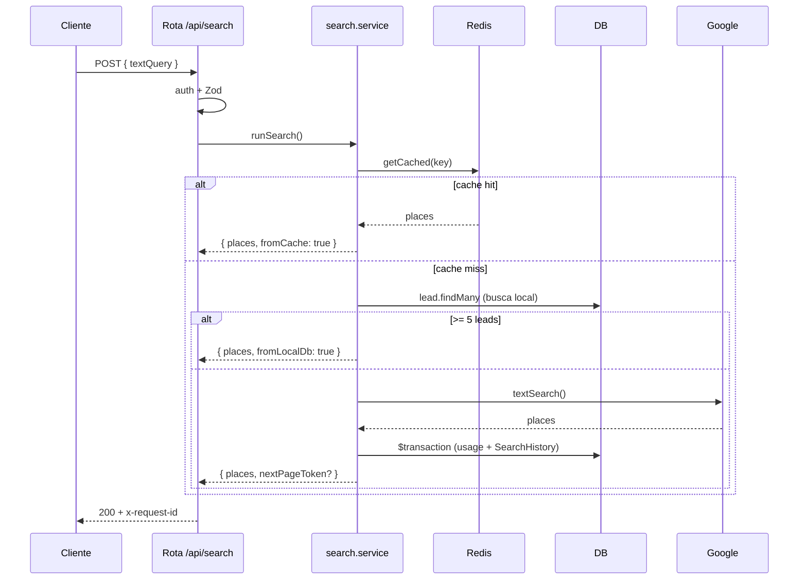
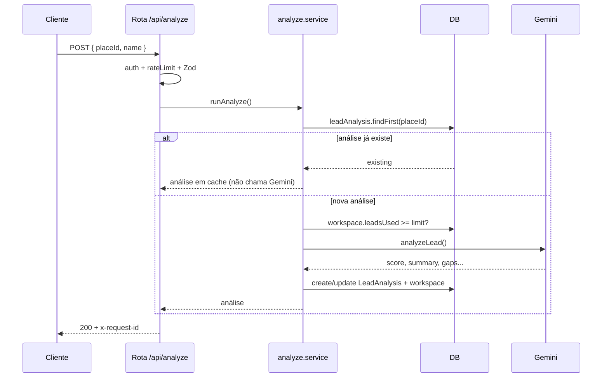
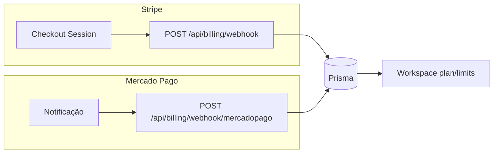

# Módulos e features (Prospector AI)

## Módulos do produto

Definidos em `src/lib/product-modules.ts`. **Ofertados:** MAPEAMENTO + INTELIGENCIA_LEADS em todos; PRO+ inclui ANALISE_CONCORRENCIA e ACAO_COMERCIAL; BUSINESS+ inclui INTELIGENCIA_MERCADO.

| Módulo | Descrição | Status backend |
|--------|-----------|-----------------|
| MAPEAMENTO | Busca por nicho/região, lista, histórico | done |
| INTELIGENCIA_LEADS | Score, classificação frio/morno/quente, potencial | partial |
| ACAO_COMERCIAL | Abordagem, e-mail pronto, WhatsApp, pitch | partial |
| ANALISE_CONCORRENCIA | Ranking por rating/reviews, gaps, presença digital | partial |
| INTELIGENCIA_MERCADO | Segmentos, maturidade digital, saturação | partial |

## APIs por área (backend)

- **Health:** GET /api/health
- **Auth:** register, session, forgot-password, reset-password, [...nextauth]
- **User:** me, profile
- **Onboarding:** complete
- **Search:** POST search, GET search/history
- **Analyze:** POST analyze
- **Competitors:** POST /api/competitors (ANALISE_CONCORRENCIA — PRO+)
- **Market Report:** POST /api/market-report (INTELIGENCIA_MERCADO — BUSINESS+)
- **Leads:** GET leads, PATCH leads/[id]
- **Details:** GET details?placeId=
- **Billing:** checkout, webhook, webhook/mercadopago, process-payment
- **Team:** members, invite, remove
- **Product:** GET product/modules
- **Sistema:** migrate-workspace
- **Admin:** stats, users, users/[id], workspaces, workspaces/[id], search-history, leads

## Diagramas

### Fluxo de Search (crítico)

### Fluxo de Analyze (crítico)

### Webhooks (billing)

- **Stripe:** evento `checkout.session.completed` → valida assinatura → atualiza workspace (plan, subscriptionId, currentPeriodEnd).
- **Mercado Pago:** query `topic` + `id` → valida token → busca pagamento → atualiza workspace. Ambos só atualizam após validação; erros são logados.

## Documentação

- **API.md** — Contrato completo das APIs (body, query, respostas e exemplos).
- **ADMIN.md** — APIs admin e ADMIN_EMAILS.
- **TESTING.md** — Testes, cobertura, meta 80%.
